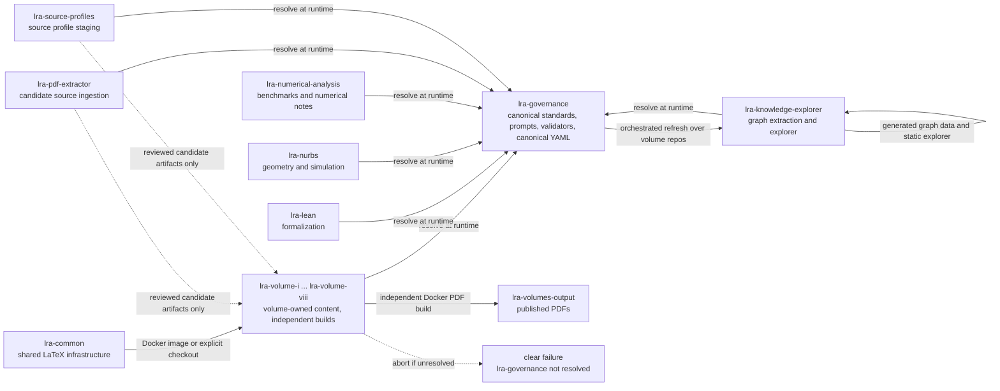
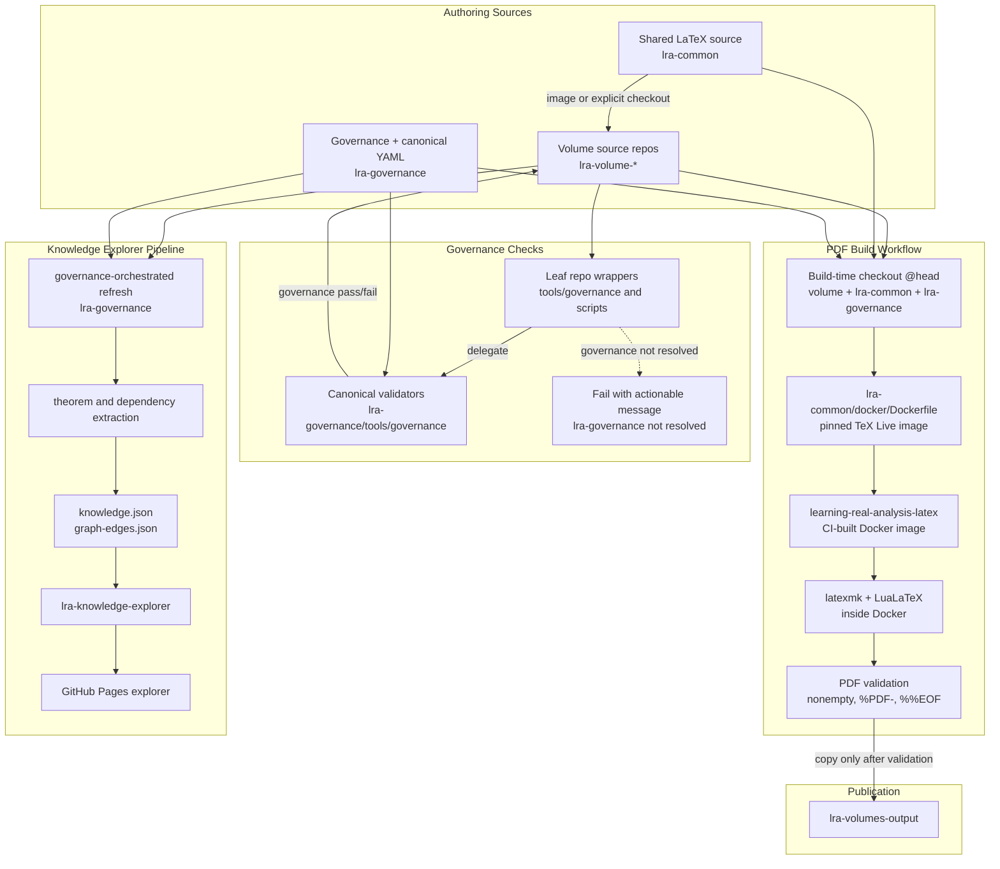

# Workflow And Data Flow Architecture

This document maps the operational workflows across the LRA repository family.
It is a routing aid: ownership rules remain in the focused architecture and
governance documents linked from `docs/architecture/README.md`.

Repositories are independent. Governance and shared LaTeX infrastructure are
consumed directly from `lra-governance` and `lra-common`; nothing is fanned out,
and there is no monorepo.

## Repository Workflow Map

## Build, Publish, And Knowledge Data Flow

## Reading Rules

- Solid arrows are approved build, generation, or runtime-resolution paths.
- Dotted arrows are staging paths that require review before content enters an
  owning source repository, or failure paths when governance cannot be resolved.
- Leaf repository governance tools are wrappers only. They delegate to the
  canonical implementations in `lra-governance/tools/governance`, using
  `LRA_GOVERNANCE_ROOT`, a sibling `lra-governance` checkout, or the build image;
  if none is available, they fail with a clear setup message.
- PDF workflows build through the checked-in Docker image definition and must
  validate the produced PDF before publishing to `lra-volumes-output`.
- Generated explorer data is derived from the volume source repos by the
  governance-orchestrated refresh; it is not hand-authored in volume
  repositories.
